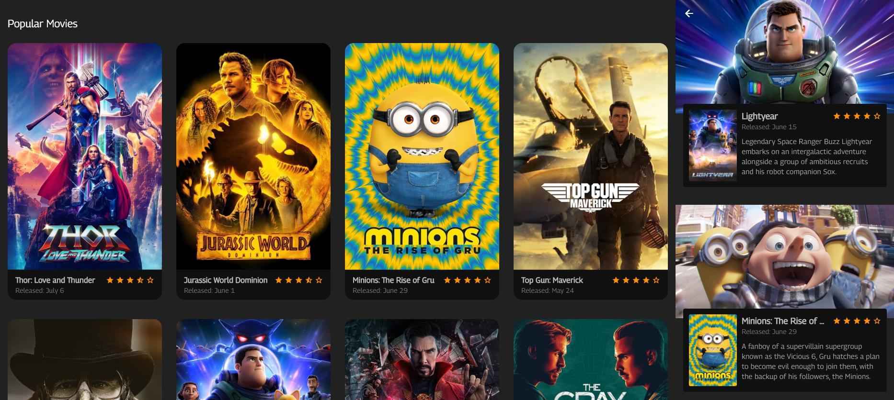

# movies

Simple Flutter app that fetches the current popular movies.
<br/>
<br/>
 
## Screenshots


<br/>
<br/>

## Usage

An API key from [TMDB](https://www.themoviedb.org/) is necessary and should be included as headers in lib/data/headers.dart.

```dart
const Map<String, String> headers = {
	'Authorization': 'Bearer ***'
};
```